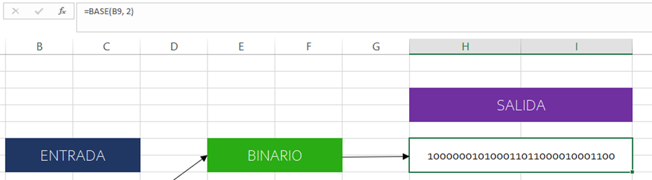
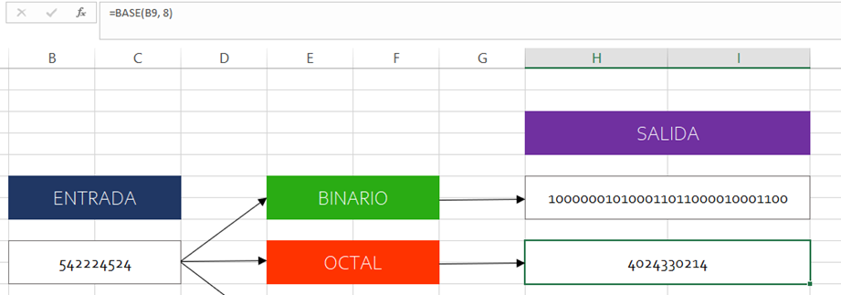
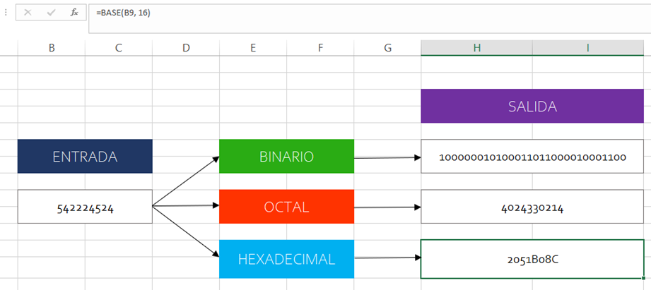
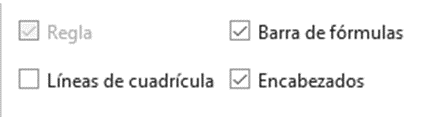
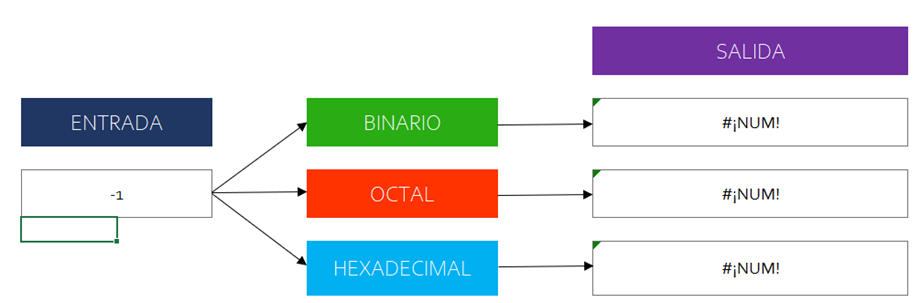
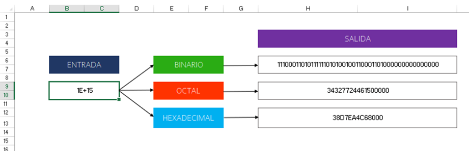
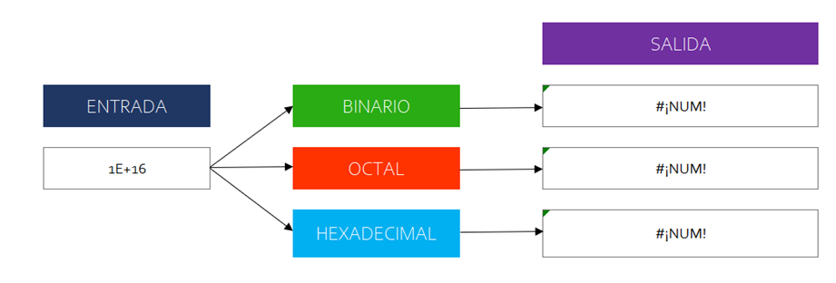
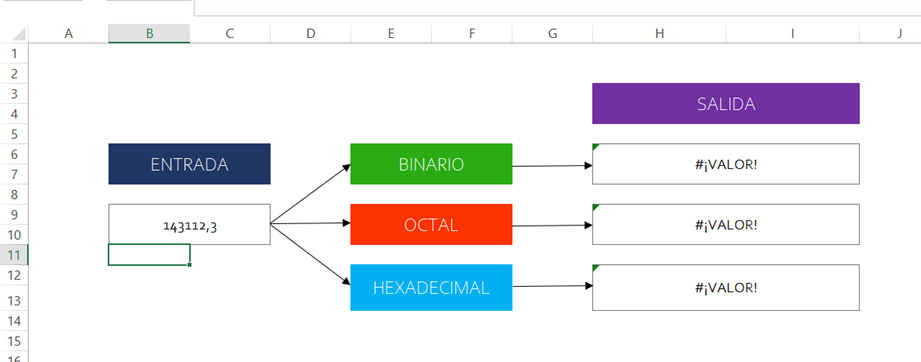

Construyendo el programa en Excel:

Ahora veremos el programa sin la cuadrícula

Vemos que el límite del número que acepta es **1E+16**. La función ``DEC.2.BIN`` solo acepta números hasta **51**1 y desde **-511**. Lo malo de ``=BASE(A1, 2)`` es que no acepta números negativos como ya vimos.

Tampoco acepta números racionales

Aunque generalmente se hace uso de números decimales enteros positivos