# Del dataset del punto 1 realice en WEKA, cuatro algoritmos de preprocesamiento (2 supervisados y 2 no supervisados). Explique por cada uno la razón de su uso.
## Abriendo el dataset con weka.
Como nuestro *dataset* es un archivo tabular `.csv`, lo convertimos al formato preferido de **WEKA**, `.arff`. Para ello hacemos:

1. Abrimos el visor de **WEKA** 

2. Abrimos el archivo `.csv`

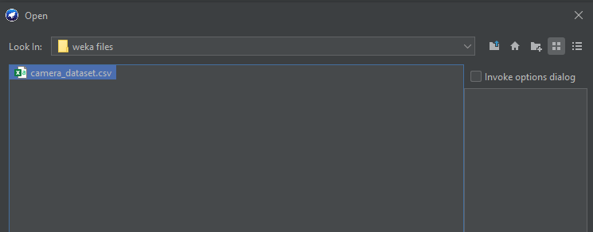
3. Hacemos click en `save as...`

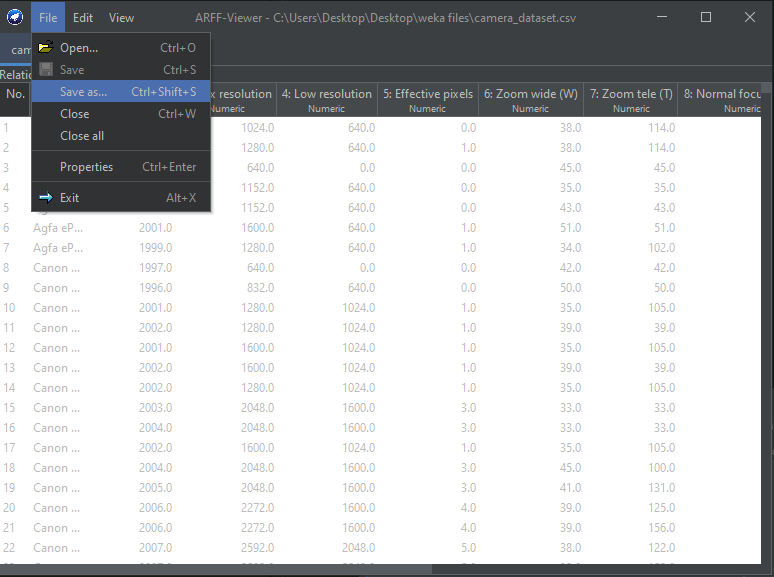
4. Guardamos el archivo

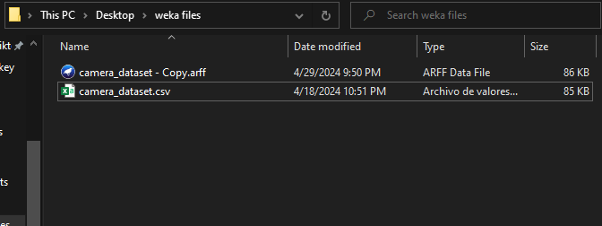
5. Y ahora si podemos abrirlo

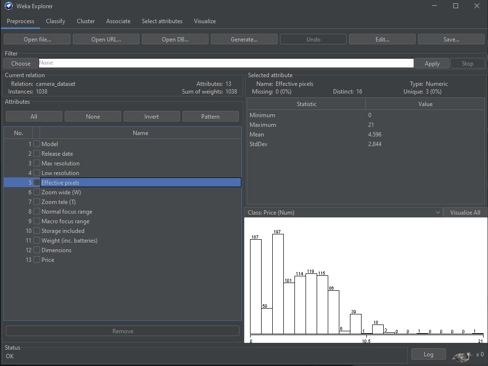
## Analizando la naturaleza de nuestro dataset
>The biggest difference between supervised and unsupervised machine learning is the type of data used. Supervised learning uses labeled training data, and unsupervised learning does not. 

>*La mayor diferencia entre el aprendizaje automático supervisado y no supervisado es el tipo de datos utilizados. El aprendizaje supervisado utiliza datos de entrenamiento etiquetados y el aprendizaje no supervisado no.*

>[Supervised vs unsupervised learning, Google Could](https://cloud.google.com/discover/supervised-vs-unsupervised-learning)

Asi pues analizando nuestro *dataset*, vemos que las **cámaras** no están clasificadas, por lo tanto estamos ante un caso de **aprendizaje no supervisado**.

>In contrast, unsupervised learning algorithms work independently to learn the data's inherent structure without any specific guidance or instruction. You simply provide unlabeled input data and let the algorithm identify any naturally occurring patterns in the dataset. Is more commonly used for exploratory data analysis and clustering tasks, such as anomaly detection, big data visualization, or customer segmentation. 

>*Por el contrario, los algoritmos de aprendizaje no supervisados funcionan de forma independiente para aprender la estructura inherente de los datos sin ninguna guía o instrucción específica. Simplemente proporciona datos de entrada sin etiquetar y deja que el algoritmo identifique cualquier patrón que ocurra naturalmente en el conjunto de datos. Se utiliza más comúnmente para análisis exploratorio de datos y tareas de agrupación, como detección de anomalías, visualización de big data o segmentación de clientes.*

>[Supervised vs unsupervised learning, Google Could](https://cloud.google.com/discover/supervised-vs-unsupervised-learning)

Asi pues, en nuestro caso no podemos usar algoritmos de *regresión lineal* ya que son de naturaleza *predictiva* y en nuestro caso, es de naturaleza *exploratoria* y *clasificatoria*.
## Preprocesamiento 
> When the data set consists of meaningless data that is incomplete (missing), noisy (outliers) and inconsistent data, preprocessing of the dataset is required. Preprocessing step includes: 

>1. Data Cleaning: Handling the missing values by ignoring that particular tuple, filling that value with some specific value and handling noisy data using binning methods, clustering, combined human & machine inspection and regression. Inconsistency may be handled manually.
>2. Data Integration: Sometimes we have data from various sources in data warehouse and we may require to combine them for further analysis. Schema integration and redundancy are major problems in data integration.
>3. Data Transformation: Data Transformation is to transform the data in given format to required format for data mining. Normalization, smoothing, aggregation and generalization are few methods to perform transformation.
>4. Data Reduction: Data analysis on huge amount of data takes a very long time. It can be performed using data cube aggregation, dimension reduction, data compression, numerosity reduction, discretization and concept hierarchy generation.

> *Cuando el conjunto de datos consta de datos sin sentido, incompletos (faltantes), ruidosos (valores atípicos) e inconsistentes, se requiere un preprocesamiento del conjunto de datos. El paso de preprocesamiento incluye:*

>1. *Limpieza de datos: Manejo de los valores faltantes ignorando esa tupla en particular, completando ese valor con algún valor específico y manejando datos ruidosos usando métodos de agrupamiento, agrupamiento, inspección y regresión combinadas de humanos y máquinas. La inconsistencia se puede manejar manualmente.*
>2. *Integración de datos: a veces tenemos datos de varias fuentes en el almacén de datos y es posible que necesitemos combinarlos para un análisis más detallado. La integración y la redundancia de esquemas son problemas importantes en la integración de datos.*
>3. *Transformación de datos: la transformación de datos consiste en transformar los datos en un formato determinado al formato requerido para la extracción de datos. La normalización, el suavizado, la agregación y la generalización son algunos métodos para realizar la transformación.*
>4. *Reducción de datos: el análisis de datos sobre una gran cantidad de datos lleva mucho tiempo. Se puede realizar mediante agregación de cubos de datos, reducción de dimensiones, compresión de datos, reducción de numerosidad, discretización y generación de jerarquía de conceptos.*

>[Srivastava, S. (2014). Weka: a tool for data preprocessing, classification, ensemble, clustering and association rule mining. International Journal of Computer Applications, 88(10).](https://citeseerx.ist.psu.edu/document?repid=rep1&type=pdf&doi=9f3837436a8942630c0d56850f5475cef655318a)

Asi pues, lo primero que haremos es filtrar los datos pedidos o corruptos. Para eso no vamos a `choose` y elegimos de entre los algorimos de *aprendizaje no supervisado*

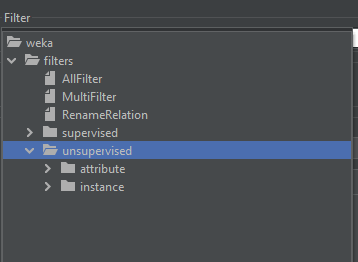

Escogeremos `NumericCleaner`

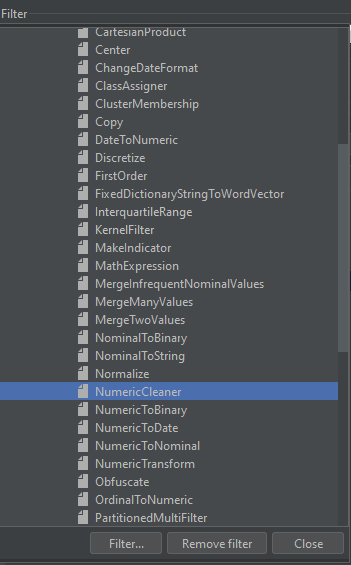

Selecionamos todos menos el modelo:

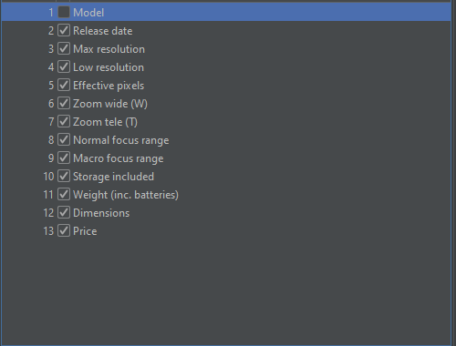

Dejaremos los atributos tal como estan:

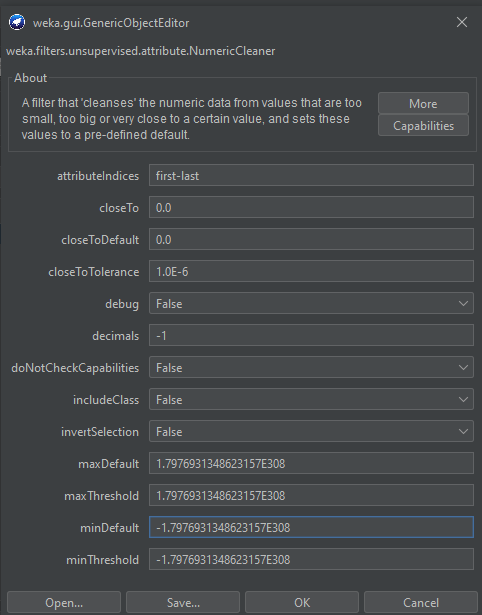

Y aplicamos. Vemos que en algunos atributos aún hay datos perdidos:

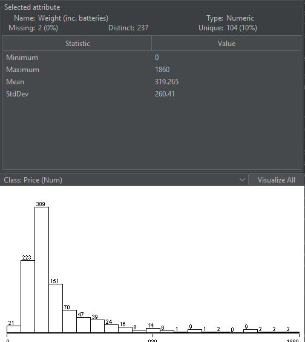

Asi que ahora lo que haremos será **eliminar los datos perdidos**.

Para ello nos vamos de nuevo a escojer un filtro dentro de `unsupervised\instance` y escojermos `RemoveWithValues`

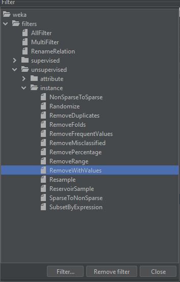

Aplicamos

Ahora remplazamos los datos perdidos (*missing*) con `ReplaceMissingValues` que se encuentra en `unsupervised\atributes`.
Y ahora si todos **vacios** fueron eliminados.

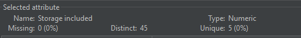

Hasta ahora hemos usado 3 algoritmos para limpiar el *dataset*.
1. `NumericCleaner`
2. `RemoveWithValues`
3. `ReplaceMissingValues`

Ahora haremos un *clustering*

## Clustering
> **Clustering** is used for finding the similar type of objects and group them together in a single cluster. Different objects are kept in different clusters. Clustering is used for unsupervised dataset but sometimes it can be used for supervised dataset also.

>*La agrupación se utiliza para encontrar tipos similares de objetos y agruparlos en un solo grupo. Diferentes objetos se mantienen en diferentes grupos. La agrupación en clústeres se utiliza para conjuntos de datos no supervisados, pero a veces también se puede utilizar para conjuntos de datos supervisados.*

>[Srivastava, S. (2014). Weka: a tool for data preprocessing, classification, ensemble, clustering and association rule mining. International Journal of Computer Applications, 88(10).](https://citeseerx.ist.psu.edu/document?repid=rep1&type=pdf&doi=9f3837436a8942630c0d56850f5475cef655318a)

Para ello nos vamos a la pestaña de `Cluster` en **WEKA**

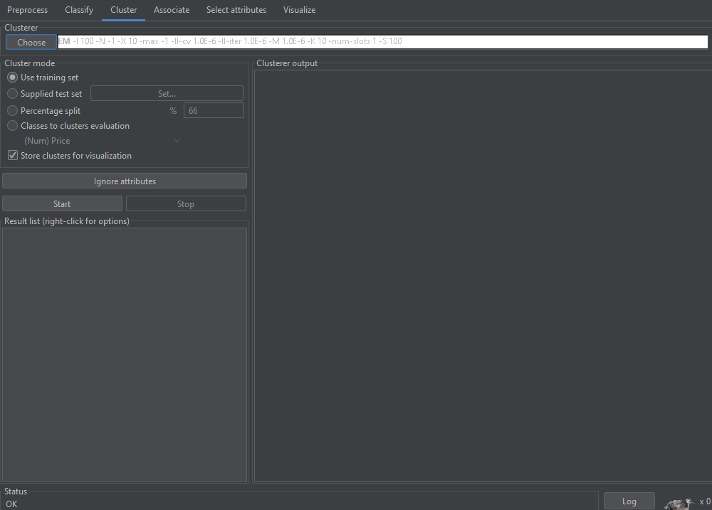

Escojeremos `SimppleKMeans` que es uno de los algoritmos más fáciles y comunes de *cluster*

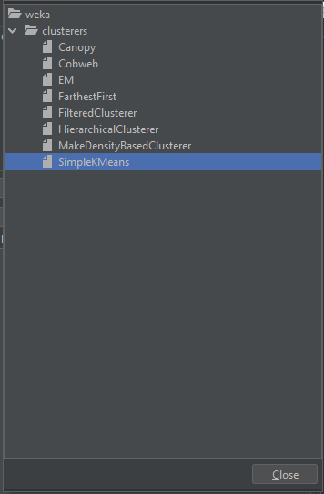

Le damos *click* a `star`

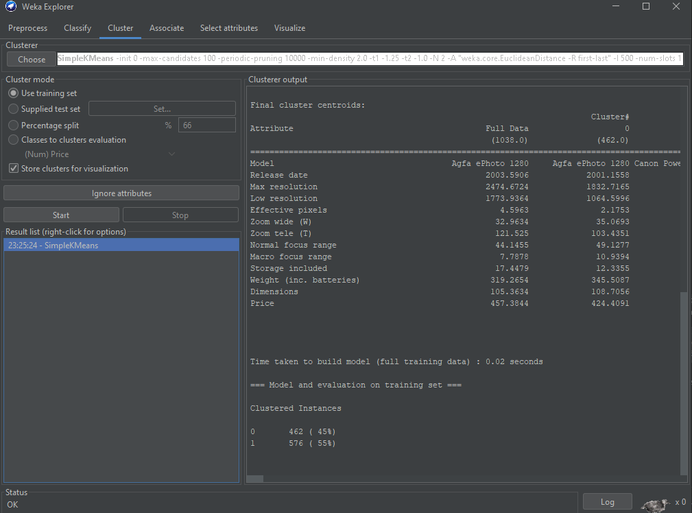

Vemos que pudo agrupar los datos en dos instancias:
1. 462 (*45%*)
2. 576 (*55%*)
Para poder ver mejor los resultados, hacemos *click* en `Visualize cluster assignments`

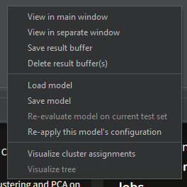

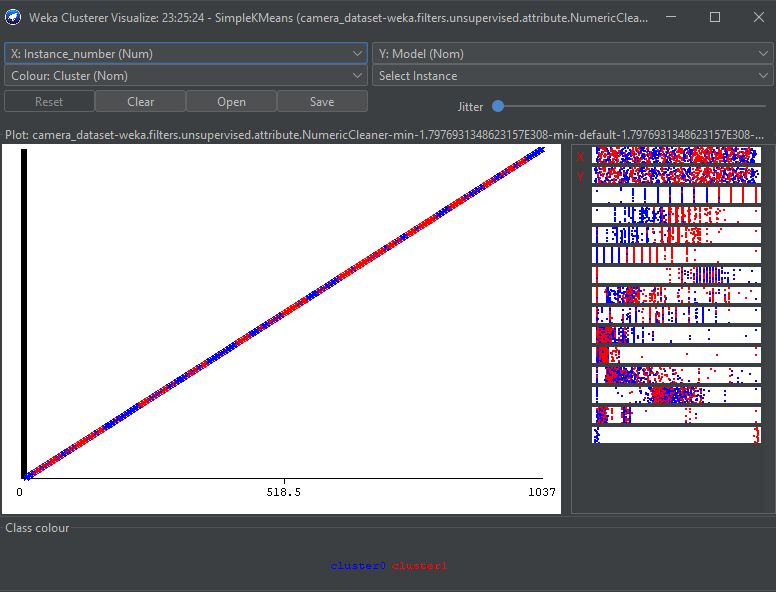

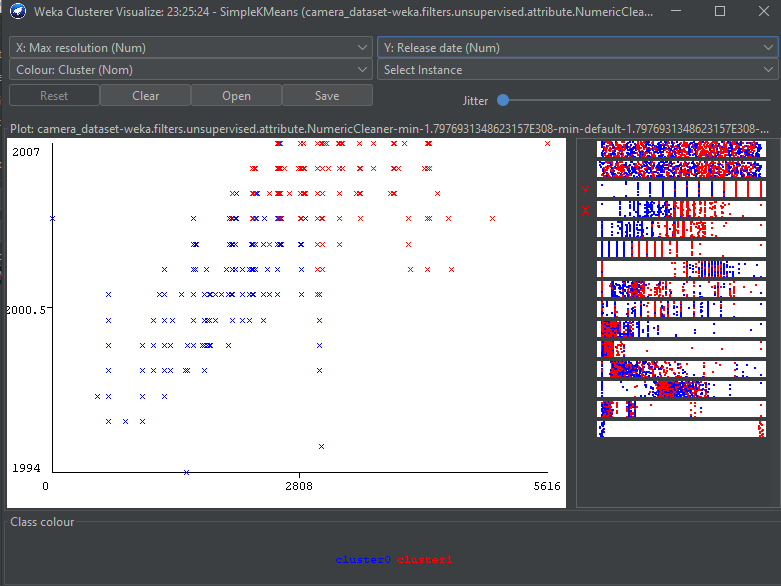

Podemos elegir diferentes ejes (*axis*).

Guardamos el prepocesado y el procesamiento:

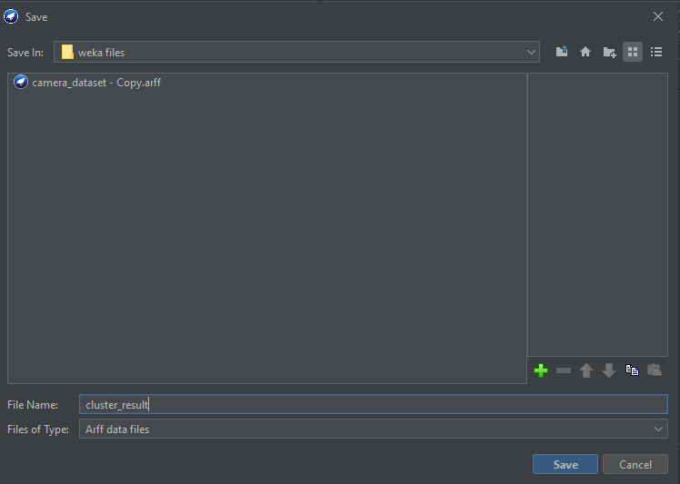

### Fuentes para realizar esta pregunta:
[K-means clustering using Weka](https://www.geeksforgeeks.org/k-means-clustering-using-weka/)

[How to handle missing values in machine learning data with Weka](https://machinelearningmastery.com/how-to-handle-missing-values-in-machine-learning-data-with-weka/)
