# Con el uso de EXCEL, realice en el algoritmo genético de f(x)=x2+x+1. Al menos tres generaciones. Automatice el cálculo.
Para poder hacer esto lo primero que haremos será definir una semilla aleatoria:

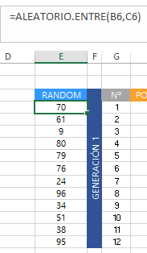

Para que no se pueda ver, la ocultaremos. Luego implementaremos un macro que copie y ordene lo que hicimos.

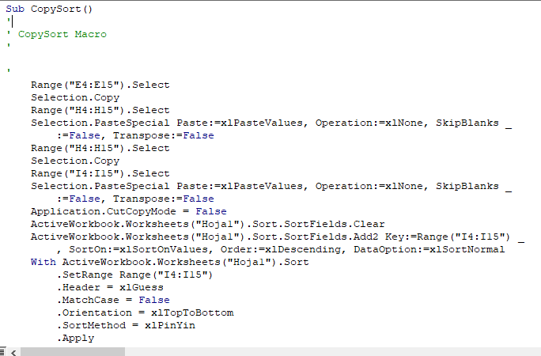

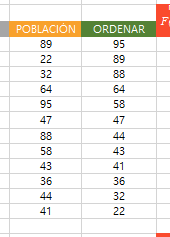

Ahora creamos una columna que devuelva la función de evaluación

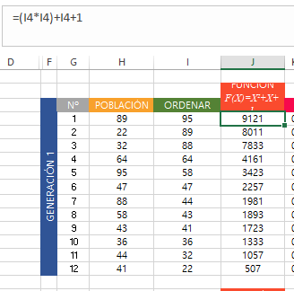

Luego convertimos nuestra población aleatoria a un número binario, y cada dígito lo almacenamos en una celda diferente. 

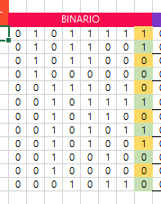

Esta será la función para convertir el primer dígito a binario

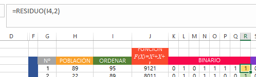

Esta será la función para convertir el último dígito a binario

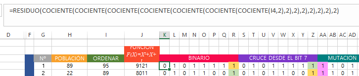

Hacemos un macro para el *cruce*

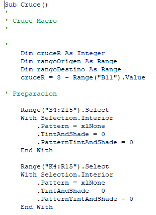

Este intercambia dos filas y toma como parámetro al valor de una celda

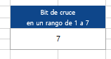

ESta función no solo intercambia los últimos n-dígitos del bit, si no que también los colorea para que sea mas entendible

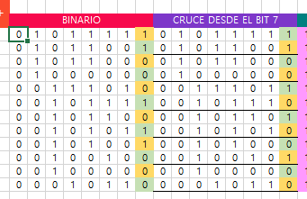

Para cada par de celdas existe párrafo de código

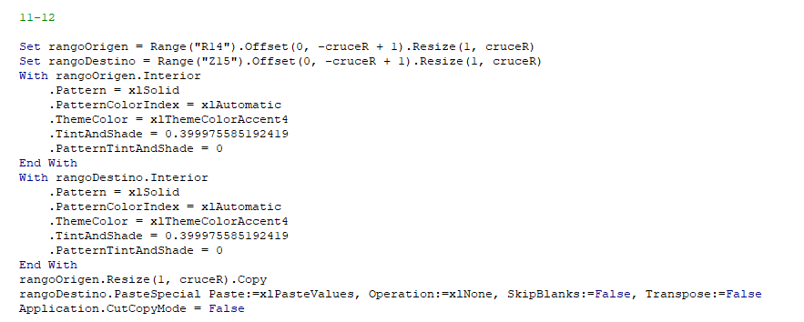

Luego hacemos la función de mutación que intercambia un cero con un uno y un uno con un cero

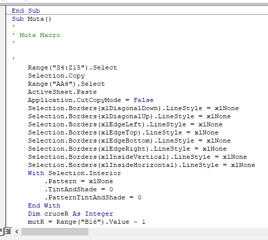

Esta función toma como argumento el valor de una celda 

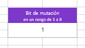

Esta función no solo intercambia los 0 y 1 de los cromosomas, si no que los colorea

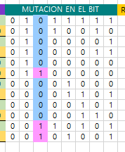

Finalmente convertimos el numero binario en 10 decimal

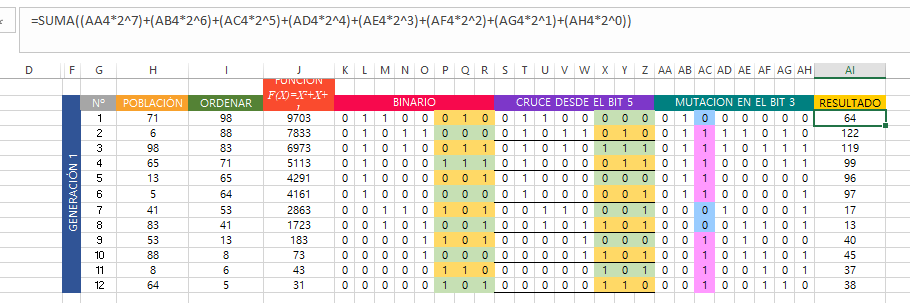

Este proceso lo repetimos 3 veces, asi tenemos el programa modular:

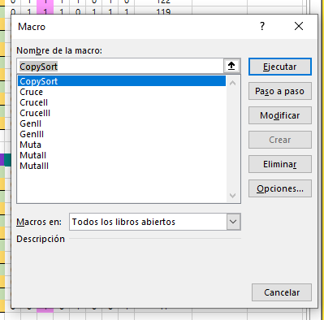

Asi el programa queda como:

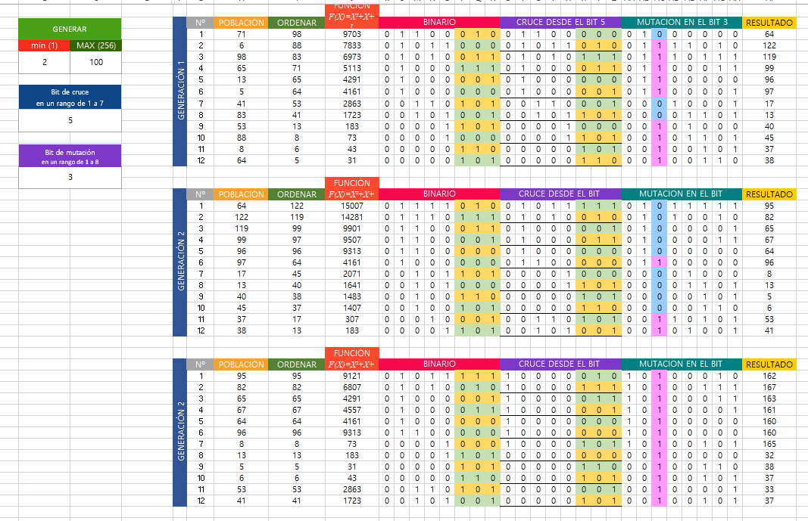

El link del video sobre el funcionamiento está [aquí](https://youtu.be/N6If5mEvpnE)

**Fuentes**:
- [Microsoft BVA](https://learn.microsoft.com/en-us/office/vba/library-reference/concepts/getting-started-with-vba-in-office)
- [Algoritmos geneticos, wikipedia](https://es.wikipedia.org/wiki/Algoritmo_gen%C3%A9tico)
-[Algoritmos geneticos, conosagi](https://conogasi.org/articulos/algoritmos-geneticos/)
- [What is the genetic algorithm](https://www.mathworks.com/help/gads/what-is-the-genetic-algorithm.html)