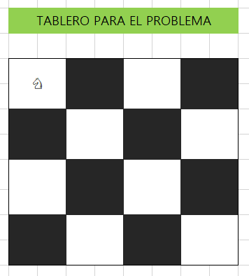
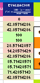
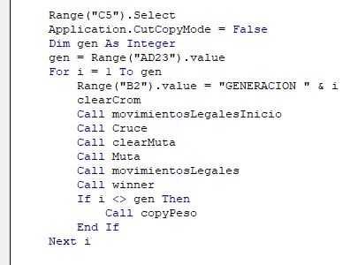

# Explique cómo se solucionaría mediante Excel el problema del caballo en el tablero de ajedrez con algoritmos genéticos (al menos una generación de 4x4 de las cuales pueden ser 5 posiciones de las 16).

Lo primero que hacemos es generar una semilla aleatoria: 

Generaremos un numero entre 1 y 8, ya que tendremos la siguiente definicion

Luego crearemos un macro para que pueda copiar y evaluar los movimientos legales:

Donde cada uno de los movimientos legales es coloreado de verde. El código es: 

Contamos la cantidad de movimientos legales

Y normalizamos los resultados en una escala del 0 al 100

Definimos unos bits de cruce, estará definido por la siguiente función: 

Esta hace el cruce solo a partir del mayor movimiento legal encontrado.

Este son coloreados a partir del siguiente código que genera una gradiente 

Luego definimos los bit de mutación, estos solo se mutaran en donde no hay movimientos legales. La coloracion estará acargo de un swicth case

Se vuelven a guardar lo movimientos legales

Y se vuelve a normalizar el resultado 

Creamos una función que pueda colorear los resultados

Se crea una nueva interpolacion de colores entre el celeste y el morado 

A cada función se le asigna un peso acorde a su normalización. Lo que tiene 100 tiene mas peso, los que tienen menos, menos peso. Luego, si sumamos todos los pesos dan menos de 12. Asi, los que tiene peso de 6, se copian 6 veces, y los que tienen peso de 0, se copian 0 veces, a menos se necesiten mas. 

Esta es la función que hace la copia en función del peso

En base a dos parámetros se puede llevar a cabo el programa

Asi pues, el programa se repite cuantas veces se haya definido en el parámetro de `Max de mutaciones`

El video de la prueba se encuentra [aqui](https://youtu.be/E66Pf02NqJw)

Su mejor resultado fue:

.png)

**Fuentes**:
- [Knight's tour, Wikipedia](https://en.wikipedia.org/wiki/Knight%27s_tour)
- [Knight’s Tour using Genetic Algorithm](https://rayantonius.com/tech/knight-tour-p5/)
- [Getting started with VBA in Office](https://learn.microsoft.com/en-us/office/vba/library-reference/concepts/getting-started-with-vba-in-office)
- [Normalización, IBM](https://www.ibm.com/docs/es/spss-statistics/saas?topic=analysis-normalization)
- [DP: distribución ponderada](https://pospotential.com/glosario-de-business-intelligence-y-gran-consumo/distribucion-ponderada/)